# Smart Desk Project

The Smart Desk is a custom-built standing desk with hidden computer hardware and embedded control systems integrated directly into the furniture. A full desktop PC and an ESP32 microcontroller are concealed within the desk, enabling intuitive, sensor-driven interactions without visible controls.

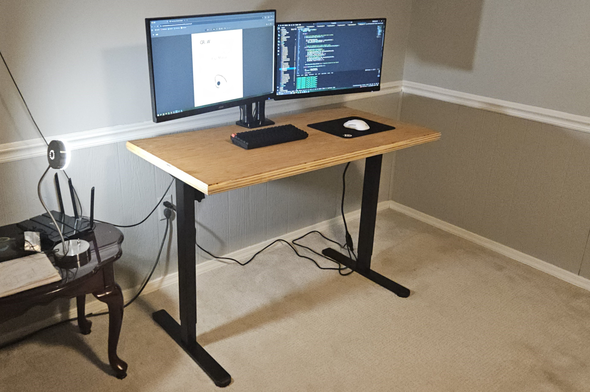
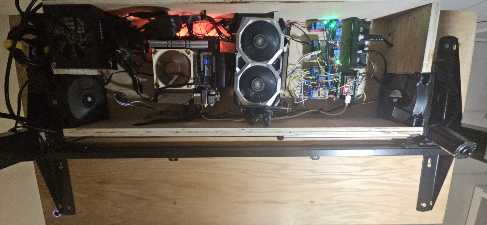
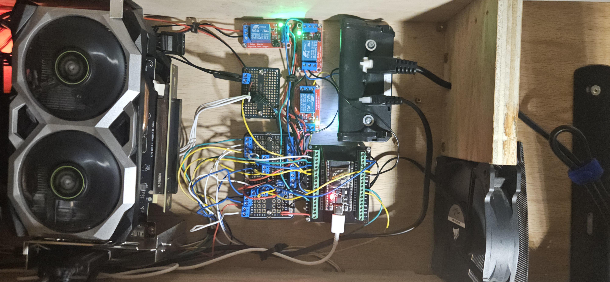

# Features

## Inuitive Desk Height Controls
Instead of using the stock control panel provided with the standing desk legs, the desk height is controlled by force input. Pulling upward on the underside of the desk raises it, while pushing down on the top surface lowers it.

This is achieved using four force sensing resistors (FSRs) embedded inside the wood. Channels were routed into the desk to conceal wiring. The original desk controller was modified by soldering wires directly to the raise and lower button contacts, allowing the ESP32 to simulate button presses using relays.


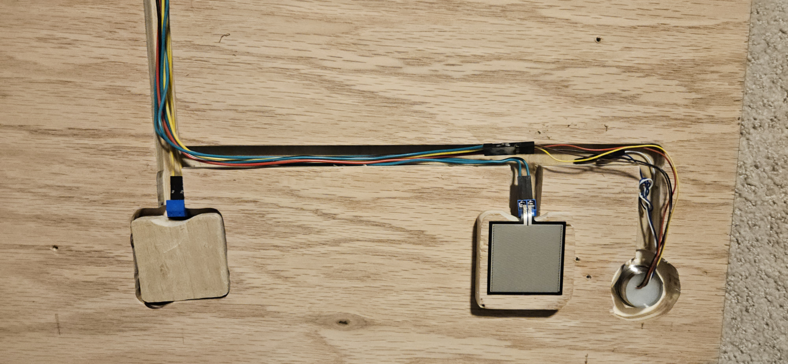

## Fingerprint Sensing Power Button
Another feature added to the desk is a fingerprint sensor used to power on the desktop computer. The fingerprint sensor is mounted to the bottom of the front right corner of the desk, utilizing the same channels as the force sensors. A relay controlled by the ESP32 is used to momentarily short the motherboard power pins when a fingerprint match is detected, allowing only authorized users to control the desktop computer’s power.


## Limiting Fan Speeds From Real-Time Temperature Readings
Finally, two temperature sensors were added, one placed near the center of the computer shroud and one near the exhaust. Temperature readings from these sensors are processed to control the duty cycle of the PWM fans. Allowing the desk to operate with minimal vibration and noise during light workloads, only increasing fan speed when necessary.

# Hardware List

- ESP32 (ESP-IDF v5.4.2)
- 4 × Force Sensitive Resistors (FSRs)
- 3 x Relay module (Desk Raise / Desk Lower / Power)
- Motorized standing desk legs and controller
- 2 x MCP9808 I2C temperature sensors
- R503 UART fingerprint sensor

# Development Process / Project Reflection

I had many sources of inspiration for this project including the series by DIY Perks on YouTube where he constructs several different "desk PCs", an embedded systems course I took in college, and my desperate need for a new desk after moving. I began this project around July 2025 and chipped away at it consistently for about 6 months. I severely underestimated the time required to complete this project. Before starting, I thought I could knock it out in a couple good weekends, which is now laughable to think about. There were so many unforseen roadblocks that came up while working on the project, almost nothing went as smoothly as I'd initially anticipated. However, through these challenges, I learned valuable skills in soldering, woodworking, and embedded programming, as well as the planning required to design something new and adapt when things do not work out.

I started by ordering the parts I'd need and attempting to write their drivers. I thought that writing these drivers wouldn't be too bad as I was familiar with C and the embedded systems course was fresh in my mind. However, I had no prior experience with Espressif or the ESP32 platform, as the course used Cortex-ARM architecture on a prefabricated development board. As a result, when issues arose, I often could not tell whether the problem was in my code or my hardware connections. 

For example, the MCP9808 temperature sensor datasheet stated that it could be powered by 2.7V–5.5V, so I initially used the 5V rail on my breadboard. After hours of debugging my code and rechecking the wiring against the datasheet, I decided to power it from the 3.3V rail instead, and it worked flawlessly. It felt like I spent 80% of my time doing 20% of the work.

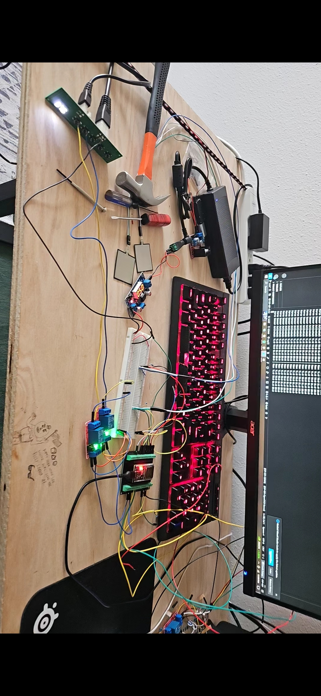
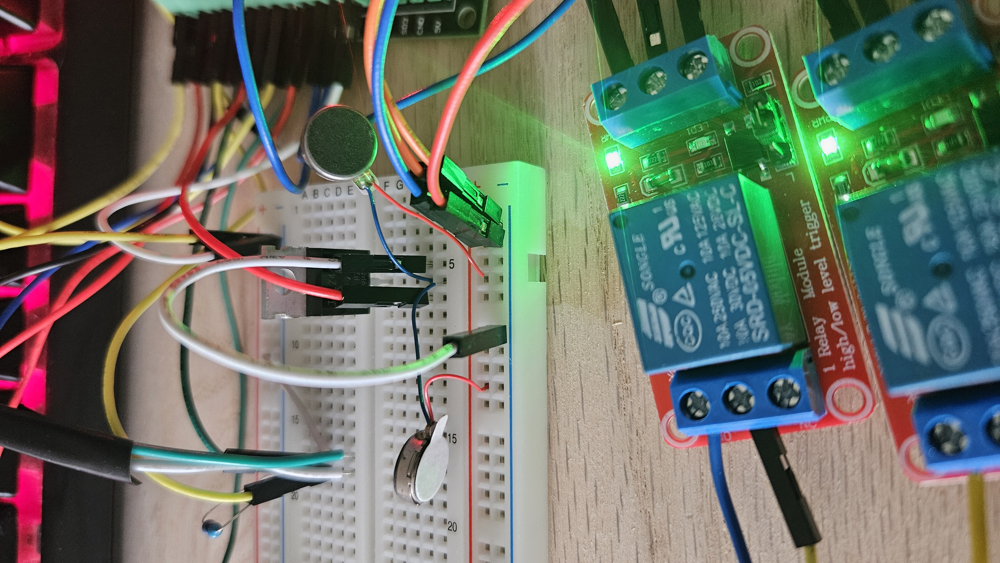

Before I left for college, my father and I got the wood I'd use to construct the top of the desk. He helped route out the hidden channels throughout the desk and plan the general structure. Once I got to college I spent a few more weeks working on the drivers and finally started to get the hang of things. During this time I also planned out everystep I would need to take at our university's makerspace to finish the desk itself. Again, I anticipated that this wouldn't take very long to complete but every step took so long for me to complete as it was my first time doing any real wood-working. Thankfully the faculty at the Makerspace was tremendously helpful and helped me work smarter.

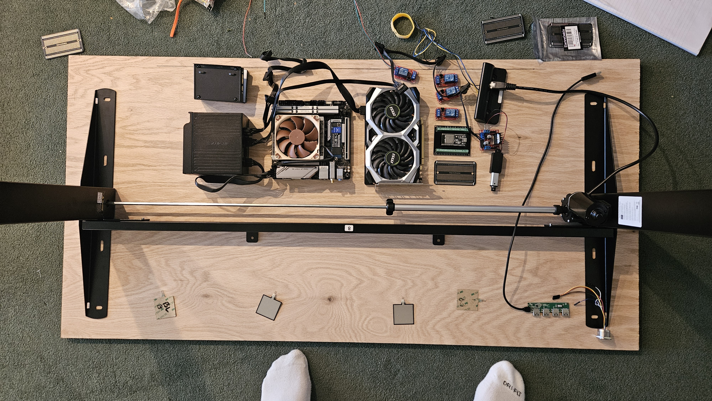
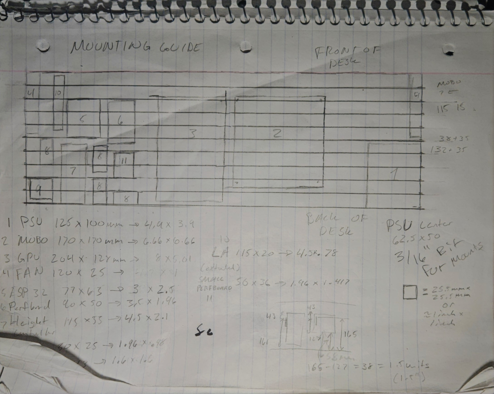
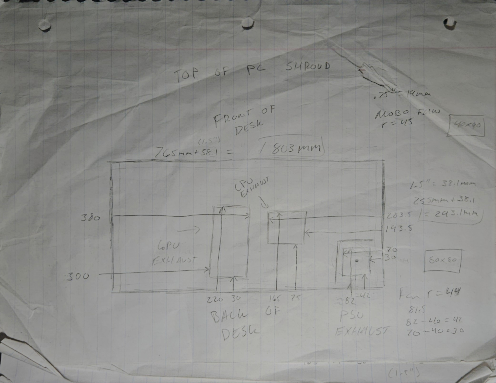
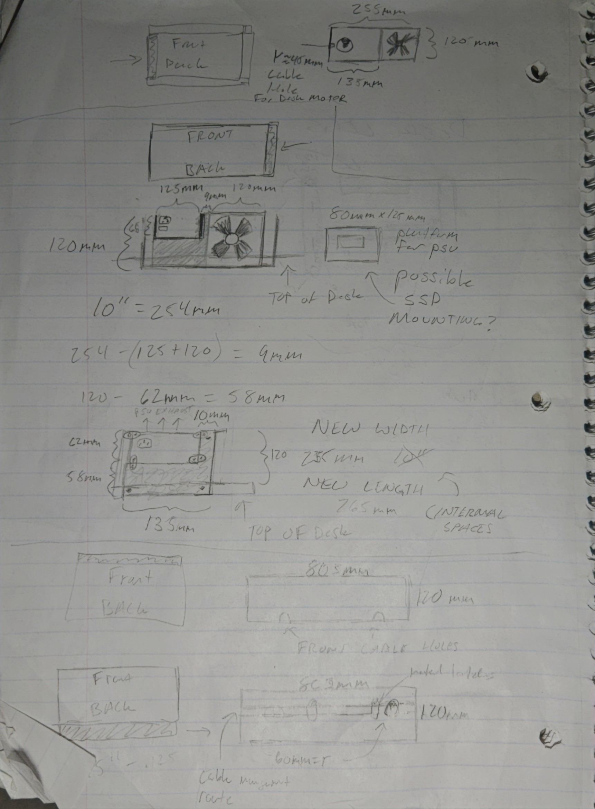

At this point I thought I had each piece individually working and all I had to do was put things together. This ended up being the part of the project I underestimated most. Before this project, I had very limited experience with soldering which caused problems. It took me 3 tries to create a control board that worked. In fact, the second iteration of my control board fried 3 ESP32's. Everytime I wanted to test out a new board I'd need disconnect all of the wiring to deconstruct the desk and carefully reconnect all the wiring. I also had to redo the crimping which took a while for me to really get my technique down. Despite trying to be as careful as possible, the process of taking the table apart and putting it back together always ended up breaking something too. Like my force sensors that broke when I was laying the bottom half of the desk onto the top half.

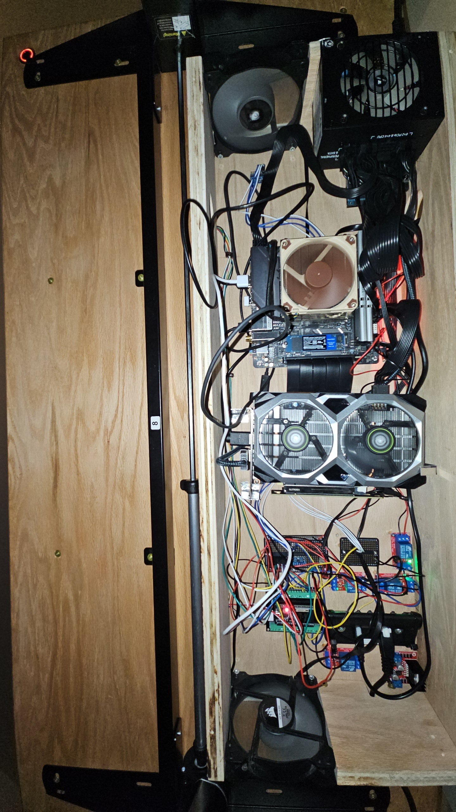
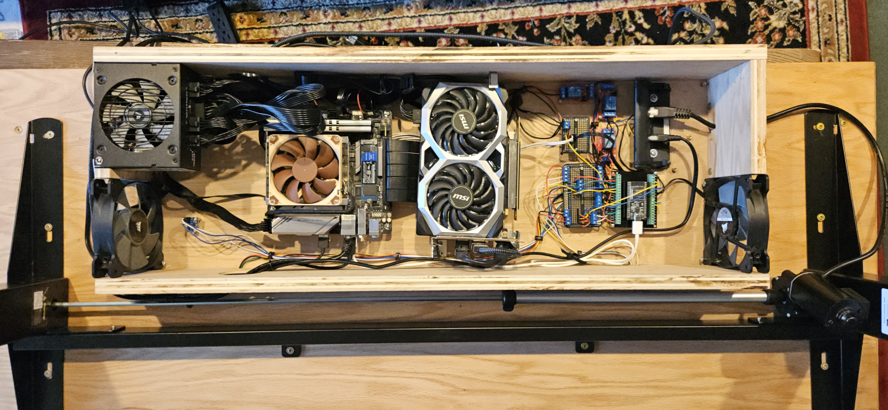

Overall, I found the experience of creating a unique piece of furniture extremely rewarding. The process was definitely humbling, but it has left me far better equipped to tackle future projects. I am glad I encountered these challenges now rather than on a more consequential project later in my career. Sometimes it was difficult to stay motivated when things broke or took much longer than expected to complete. However, whenever I showed my friends my desk they were really interested which both surprised and motived me. It gave me hope that at some day this desk will be a pretty sweet conversation piece in my future home.

# Video Demonstration


# Future Plans (Priority descending)

- Use a laser cutter to add ventilation to the acrylic
- Build a mobile app to monitor temperature sensors, calibrate force sensors, enroll and remove fingerprints from the R503 library, and set temperature thresholds
- Incorporate a linear actuator to reveal a hidden USB hub (similar to a pop-up outlet)
- Use vibration to provide user feedback (similar to a phone)

## Datasheets

- [R503 Fingerprint Module](https://download.mikroe.com/documents/datasheets/R503_datasheet.pdf)
- [MCP9808 Digital Temperature Sensor](https://ww1.microchip.com/downloads/en/DeviceDoc/25095A.pdf)

## Build and Flash

This project is built using the ESP-IDF framework.

```bash
idf.py set-target esp32
idf.py build
idf.py flash
idf.py monitor
